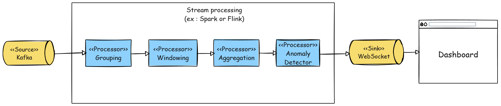
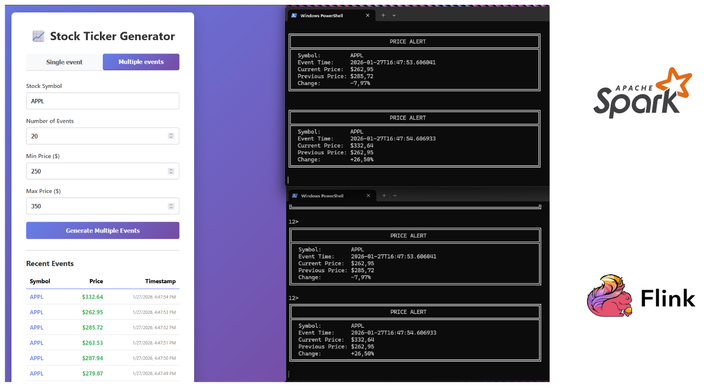
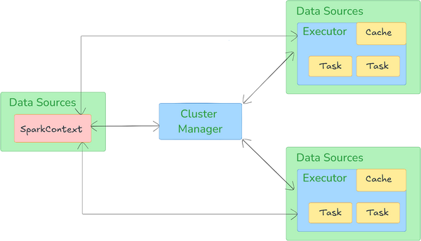
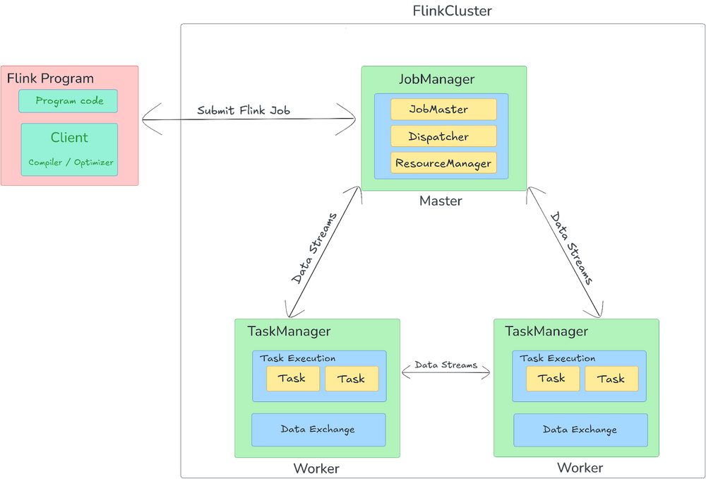
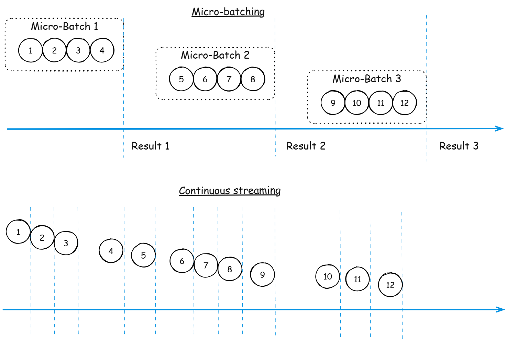
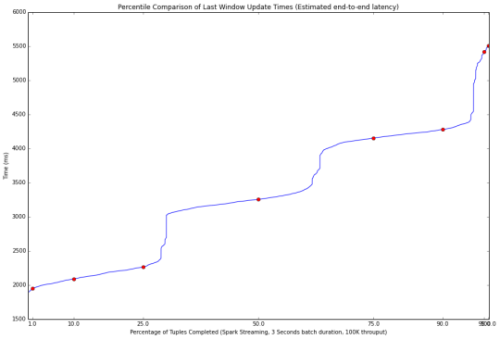
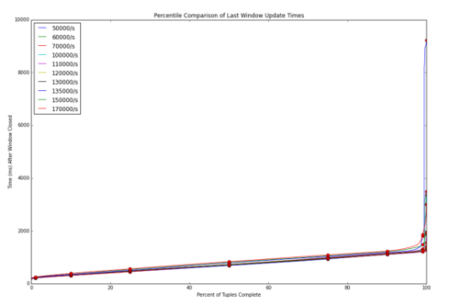

<style>
section.centered-image {
  display: flex;
  flex-direction: column;
  justify-content: center;
}
section.centered-image p {
  text-align: center;
}
section.logo-header {
  position: relative;
}
section.logo-header h2 {
  display: flex;
  justify-content: space-between;
  align-items: center;
}
section.logo-header h2 img {
  height: 100px;
  margin-left: 20px;
}
section.bottom-right {
  display: flex;
  flex-direction: column;
  justify-content: space-between;
  align-items: center;
}
section.bottom-right .content {
  text-align: left;
  margin-bottom: 20px;
  align-self: flex-end;
  font-size: 0.6em;
}
section.bottom-right .content p {
  margin: 5px 0;
}
section table {
  margin: 40px auto 0;
}
section table th,
section table td {
  font-size: 0.85em;
}
section.winner table {
  table-layout: fixed;
  width: 80%;
}
small {
  font-size: 0.4em;
  display: block;
  margin-top: -20px;
}
</style>

<!-- _class: bottom-right -->

# Real-Time Streaming Showdown


<div class="content">

**Sherif Behna**
Data Architect
Hikari Data inc.

</div>

---

## What is stream processing ?

- Stream : Continuous sequence of events over time
- Stream processing : Processing these events to get insights

---

## Typical use cases

- Real-time analytics
- Event-driven applications
- Sensor data processing (IoT)
- Business monitoring and alerting
- Anomaly and fraud detection

---

## Simple demo



---

<!-- _class: centered-image -->

## Demo



---

<!-- _class: centered-image -->

## Timeline


---

<!-- _class: logo-header centered-image -->

## Apache Spark 

- **Micro-batch processing** - Divides stream into small batches
- **APIs**:
  - DStream API (legacy)
  - Structured Streaming (DataFrame API)
  - Spark SQL integration
- **Additional libraries**: MLlib, GraphX, Spark Connect, Pandas Spark
- **Mature ecosystem**

---

<!-- _class: logo-header centered-image -->

## Spark Architecture 



---

<!-- _class: logo-header centered-image -->

## Spark Code Snippet 

```java
Dataset<Row> lines = spark
    .readStream()
    .format("socket")
    .option("host", SOCKET_HOST)
    .option("port", SOCKET_PORT)
    .load();

Dataset<StockData> stockData = lines
    .flatMap(new JsonParser(), Encoders.bean(StockData.class));

Dataset<String> alerts = stockData
    .groupByKey(
        (MapFunction<StockData, String>) StockData::getSymbol,
        Encoders.STRING()
    )
    .mapGroupsWithState(
        new PriceChangeDetector(),
        Encoders.bean(StockState.class),
        Encoders.STRING(),
        GroupStateTimeout.NoTimeout()
    )
    .filter((FilterFunction<String>) alert -> alert != null && !alert.isEmpty());

StreamingQuery query = alerts
    .writeStream()
    .outputMode("update")
    .format("console")
    .start();
```

---

<!-- _class: logo-header centered-image -->

## Apache Flink 

- **Designed for real-time stream processing**
- **Processes events independently (true streaming)**
- **APIs**:
  - DataStream API (low-level, event-by-event processing)
  - Table API (relational operations)
  - Flink SQL
- **Additional libraries**: Flink CDC, Flink ML, Flink CEP, Flink Agents
- **Mature ecosystem (less than Spark but mature enough)**

---

<!-- _class: logo-header centered-image -->

## Flink Architecture 



---

<!-- _class: logo-header centered-image -->

## Flink Code Sample 

```java
final StreamExecutionEnvironment env = StreamExecutionEnvironment.getExecutionEnvironment();

DataStream<String> socketStream = env.socketTextStream(SOCKET_HOST, SOCKET_PORT);

socketStream
    .flatMap(new JsonParser())
    .keyBy(StockData::getSymbol)
    .flatMap(new PriceChangeDetector())
    .print();

env.execute("Flink Stock Price Alert Processor");
```

---

<!-- _class: centered-image -->

## Micro-batch vs continuous streaming



---

## Performance

|  |  |
|:----:|:----:|
|  |  |

<small>Source: https://yahooeng.tumblr.com/post/135321837876/benchmarking-streaming-computation-engines-at</small>

---

## Expected features of a streaming platform

| Feature |  |  |
|---------|:----:|:----:|
| Supports multiple sources and sinks | ✓ | ✓ |
| Multiple connectors | ✓ | ✓ |
| Integration with monitoring and management tools | ✓ | ✓ |
| Language support (streaming) | Java, Scala, Python, SQL, R | Java, Scala, Python |
| Scalability (distributed) | ✓ | ✓ |

---

## Stateless operators

| Feature |  |  |
|---------|:----:|:----:|
| Transformations (map / flatMap) | ✓ | ✓ |
| Filters | ✓ | ✓ |
| Projections (select) | ✓ | ✓ |
| Join with static data | ✓ | ✓ |
| Partitioning | ✓ | ✓ |

---

## Stateful operators

| Feature |  |  |
|---------|:----:|:----:|
| Grouping | ✓ | ✓ |
| Aggregations (sum, count, avg, custom) | ✓ | ✓ |
| Windows (tumbling and sliding)  | ✓ | ✓ |
| Stream to stream join | ✓ | ✓ |
| Sessionalizing | ✓ | ✓ |

---

## Pitfalls of streaming apps

| Feature |  |  |
|---------|:----:|:----:|
| Time management (event time vs processing time) | ✓ | ✓ |
| Late-arriving data (Watermarks) | ✓ | ✓ |
| Fine-grained state management | Limited | ✓ |
| Delivery semantics (at-most once, at-least once, exactly once) | at-least once | exactly once |
| Fault tolerance | limited | ✓ |
| Handle backpressure | limited | ✓ |

---

## Bread and butter considerations

| Feature |  |  |
|---------|:----:|:----:|
| Learning curve | Moderate | Steep |
| Product maturity | High | Medium |
| Ecosystem maturity | High | Medium |
| Vendor support | High | Low |
| Scalability | Medium | High |

---

## Do you really need "real-time"

- Real-time means milliseconds to a few seconds (max 5s end-to-end)
- Extra complexity
- Is there a business case for it ?

---

<!-- _class: winner -->

## And the winner is...

|  |  |
|:----:|:----:|
| Mature and stable ecosystem | Low latency and predictable performance |
| Ease of use | Responsive event-driven apps |
| Data engineering / ML use cases | Robust state management and fault tolerance |

---

<!-- _class: centered-image -->

## Q & A

Repo : https://github.com/shbehna/streaming-spark-flink

